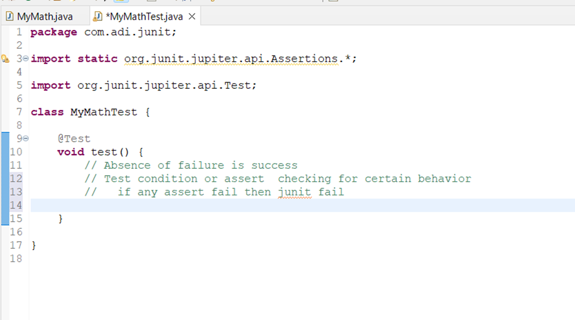

# ***Section-11. Introduction to JUNIT***
# 263 Step-1 What is Junit and Unit Testing?
apne s/w ki jar ya war file deploy karke test karna  usko --> ***system testing or integration testing kehte***..

apne individual method ya group of method ya particular class ki test karna called as ***Unit test.***


# 264 Step-2 Your first JUnit project and Green Bar
### We need a piece of code for which we write unit test. So let's create java project


### Let's create a class
```java
package com.adi.junit;

public class MyMath {

	//{1,2,3}=> 1+2+3=6 ((pass an array with number) and it return sum of it)
	public int calculateSum(int[] numbers) {
		
		int sum =0;
		for(int number : numbers) {
			sum += number;
		}
		
		return sum;
	}
}
```
### Write Junit Test for this method


### So all our source code is present in src folder and test related stuff (junit test) present in test folder
### Create Unit test

### Provide appropriate details


Assertion
-	दृढ़ कथन, निश्‍चयपूर्वक कथन, दावा


### Run it


### Red bar indicates test fail
### Now make this unit test pass & see Famous Green Bar which comes as test passes


### Write test for MyMathTest class

### Now check the result against expected value

### What happen if you change expected result to 5
```java
package com.adi.junit;

import static org.junit.jupiter.api.Assertions.*;

import org.junit.jupiter.api.Test;

class MyMathTest {

	@Test
	void test() {

		MyMath math = new MyMath();

		int numbers[] = { 1, 2, 3 };

		int result = math.calculateSum(numbers);

		System.out.println(result);

		int expectedResult = 5; //Changing to 5

		assertEquals(expectedResult, result);
	}

}
```

# 265 Step-3 Your first code and first unit test
### Let's create another test case
```java
package com.adi.junit;

import static org.junit.jupiter.api.Assertions.*;

import org.junit.jupiter.api.Test;

class MyMathTest {

	@Test
	void test() {
		MyMath math = new MyMath();
		int numbers[] = { 1, 2, 3 };
		int result = math.calculateSum(numbers);
		System.out.println(result);
		int expectedResult = 6;
		assertEquals(expectedResult, result);
	}
	
	//Create another test scenario 
	// test with 0 element or no element in array
	//  {} ==> 0
	@Test
	void test1() {
		MyMath math = new MyMath();
		int numbers[] = {};
		int result = math.calculateSum(numbers);
		System.out.println(result);
		int expectedResult = 0;
		assertEquals(expectedResult, result);
	}	
}
```

### There is lot of duplicacy in code let's remove and also we inline all things

```java
package com.adi.junit;

import static org.junit.jupiter.api.Assertions.*;

import org.junit.jupiter.api.Test;

class MyMathTest {
	
	private MyMath math = new MyMath();
	
	@Test
	void calculateSum_ThreeMemberArray() {
		
		assertEquals(6, math.calculateSum(new int[] { 1, 2, 3 }));
	}
	
	//Create another test scenario 
	// test with 0 element or no element in array
	//  {} ==> 0
	@Test
	void calculateSum_ZeroLengthArray() {
		
		assertEquals(0, math.calculateSum(new int[] {}));
	}	
}
```

## Advantage
- Jaise apne code commit kiya version control ke andar, so devops ye aapki unit test continous integration se chalate rehta.
- Agar kisne usme chechad kari aapko sidha mail aavenga. Ki ***A bug was introduced and this unit test fails.***
# 266 Step-04 Exploring other assert method.
### Create a new JunitTest file
ctr + N 


```java
package com.adi.junit;

import static org.junit.Assert.assertTrue;
import static org.junit.jupiter.api.Assertions.*;

import java.util.Arrays;
import java.util.List;

import org.junit.jupiter.api.Test;

class MyAssertTest {

	List<String> todos = Arrays.asList("AWS","AZURE","DEVOPS");
	@Test
	void test() {
	
		//There are lot of assert method present here
		//  type assert. and u will see all methods		
		
		// LHS --> expected value
		// RHS --> actual value
		// message also u can provide
		
		//for boolean value	
		assertEquals(true, todos.contains("AWS"));//Green Bar
		
		//U can test with number as well
		assertEquals(3, todos.size()); //Green BAR
		
		//Shortcut methods only availble for booleans
		assertTrue(todos.contains("AWS"));//Green Bar
		assertFalse(todos.contains("GCP"));//Green BAR
		
		//It can also support the message
		assertTrue("Sth went wrong",true);
		assertEquals(3, todos.size(),"Nothing happen");
		
		//assertNull, assertNotNull
		
		//arrays equals
		assertArrayEquals(new int[] {1,2}, new int[] {1,2});//Green Bar
		
		//U can compare assertEquals with any datatype you want
		}		
	}

```
# 267 Step-5 exploring few important junit annotation.
Junit5 also supports few annotations like BeforAll,BeforeEach,AfterAll and AfterEach  
ctr + N

### One important thing that you need to remember about JUnit is that the JUnit framework does not guarantee the execution in the same order you have in here.


### Common setup you want to do for all the test


#### beforeAll() method should be static- good improvement 
### Since beforeAll() method is a class level method, it run before all the tests(). Isiliye uko static hona

```java
package com.adi.junit;

import static org.junit.jupiter.api.Assertions.*;

import org.junit.jupiter.api.AfterAll;
import org.junit.jupiter.api.AfterEach;
import org.junit.jupiter.api.BeforeAll;
import org.junit.jupiter.api.BeforeEach;
import org.junit.jupiter.api.Test;

class MyBeforAfterTest {
	// Common setup for all methods
	// Setup for all test
	@BeforeAll
	static void beforeAll() {
		System.out.println("before all");
	}

	// Any set up need to be done/run before each method
	// use beforeEach()
	// Setup for specific test
	@BeforeEach
	void beforEach() {
		System.out.println("Before Each");
	}

	// test
	@Test
	void test1() {
		System.out.println("Test1");
	}

	@Test
	void test2() {
		System.out.println("Test2");
	}

	@Test
	void test3() {
		System.out.println("Test3");
	}

	// u have to perform clean up activity after each method use afterEach()
	// Cleanup for specific test
	@AfterEach
	void afterEach() {
		System.out.println("After Each");
	}

	// Cleanup for all test
	@AfterAll
	static void afterAll() {
		System.out.println("after all");
	}
}
Ouput:
before all
Before Each
Test1
After Each
Before Each
Test2
After Each
Before Each
Test3
After Each
after all
```

# ***SECTION Appendix - 12. Introduction to MOKITO***
# 269 Step-0 Introduction : Mokito in 5 steps

Whenever we talk about applications,
they have multiple layers.
You have a web layer, business layer, data layer.

You have thousands of classes talking to each other.
Each of the classes have multiple dependencies,  
so the question is,  
***how do you write unit tests for classes
with multiple dependencies?  
How do you replace the dependencies that are present for a specific class?***

stub mean in programming?
 - A method stub or simply stub in software development is a piece of code used to stand in for some other programming functionality.    
  A stub may simulate the behavior of existing code (such as a procedure on a remote machine, such methods are often called mocks) or be a temporary substitute for yet-to-be-developed code.
# 270 Step-1 Setting up a spring  boot project.


### If you go to pom.xml you would see starter-test and this depedency brings mokito

### If i go in Effective pom in dependency section and search for mokito i will see mokito-version

### having dependency


### I want to test this method without having without having a real data interface,without actually talking to a database.
### How do we do that?
# 271. Step-2 Understanding problem with Stubs.

