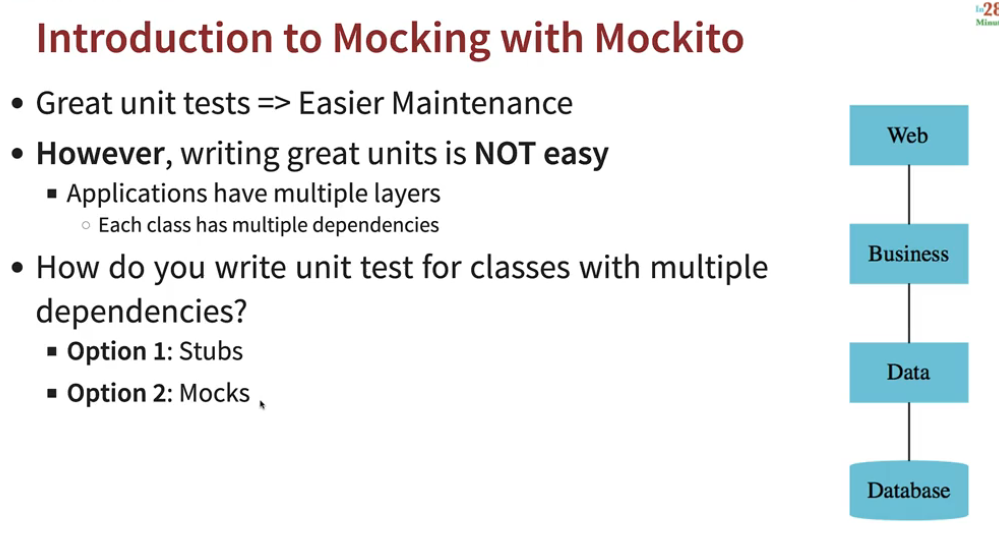
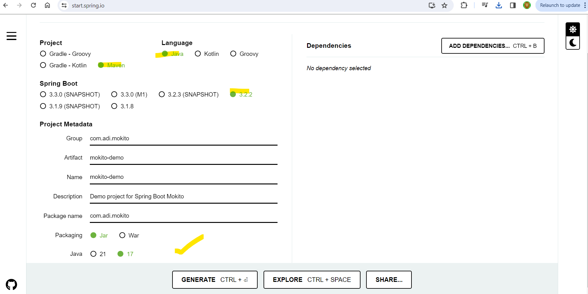

# ***Section-11. Introduction to JUNIT***
# 263 Step-1 What is Junit and Unit Testing?
apne s/w ki jar ya war file deploy karke test karna  usko --> ***system testing or integration testing kehte***..

apne individual method ya group of method ya particular class ki test karna called as ***Unit test.***


# 264 Step-2 Your first JUnit project and Green Bar
### We need a piece of code for which we write unit test. So let's create java project


### Let's create a class
```java
package com.adi.junit;

public class MyMath {

	//{1,2,3}=> 1+2+3=6 ((pass an array with number) and it return sum of it)
	public int calculateSum(int[] numbers) {
		
		int sum =0;
		for(int number : numbers) {
			sum += number;
		}
		
		return sum;
	}
}
```
### Write Junit Test for this method


### So all our source code is present in src folder and test related stuff (junit test) present in test folder
### Create Unit test

### Provide appropriate details


Assertion
-	दृढ़ कथन, निश्‍चयपूर्वक कथन, दावा


### Run it


### Red bar indicates test fail
### Now make this unit test pass & see Famous Green Bar which comes as test passes


### Write test for MyMathTest class

### Now check the result against expected value

### What happen if you change expected result to 5
```java
package com.adi.junit;

import static org.junit.jupiter.api.Assertions.*;

import org.junit.jupiter.api.Test;

class MyMathTest {

	@Test
	void test() {

		MyMath math = new MyMath();

		int numbers[] = { 1, 2, 3 };

		int result = math.calculateSum(numbers);

		System.out.println(result);

		int expectedResult = 5; //Changing to 5

		assertEquals(expectedResult, result);
	}

}
```

# 265 Step-3 Your first code and first unit test
### Let's create another test case
```java
package com.adi.junit;

import static org.junit.jupiter.api.Assertions.*;

import org.junit.jupiter.api.Test;

class MyMathTest {

	@Test
	void test() {
		MyMath math = new MyMath();
		int numbers[] = { 1, 2, 3 };
		int result = math.calculateSum(numbers);
		System.out.println(result);
		int expectedResult = 6;
		assertEquals(expectedResult, result);
	}
	
	//Create another test scenario 
	// test with 0 element or no element in array
	//  {} ==> 0
	@Test
	void test1() {
		MyMath math = new MyMath();
		int numbers[] = {};
		int result = math.calculateSum(numbers);
		System.out.println(result);
		int expectedResult = 0;
		assertEquals(expectedResult, result);
	}	
}
```

### There is lot of duplicacy in code let's remove and also we inline all things

```java
package com.adi.junit;

import static org.junit.jupiter.api.Assertions.*;

import org.junit.jupiter.api.Test;

class MyMathTest {
	
	private MyMath math = new MyMath();
	
	@Test
	void calculateSum_ThreeMemberArray() {
		
		assertEquals(6, math.calculateSum(new int[] { 1, 2, 3 }));
	}
	
	//Create another test scenario 
	// test with 0 element or no element in array
	//  {} ==> 0
	@Test
	void calculateSum_ZeroLengthArray() {
		
		assertEquals(0, math.calculateSum(new int[] {}));
	}	
}
```

## Advantage
- Jaise apne code commit kiya version control ke andar, so devops ye aapki unit test continous integration se chalate rehta.
- Agar kisne usme chechad kari aapko sidha mail aavenga. Ki ***A bug was introduced and this unit test fails.***
# 266 Step-04 Exploring other assert method.
### Create a new JunitTest file
ctr + N 


```java
package com.adi.junit;

import static org.junit.Assert.assertTrue;
import static org.junit.jupiter.api.Assertions.*;

import java.util.Arrays;
import java.util.List;

import org.junit.jupiter.api.Test;

class MyAssertTest {

	List<String> todos = Arrays.asList("AWS","AZURE","DEVOPS");
	@Test
	void test() {
	
		//There are lot of assert method present here
		//  type assert. and u will see all methods		
		
		// LHS --> expected value
		// RHS --> actual value
		// message also u can provide
		
		//for boolean value	
		assertEquals(true, todos.contains("AWS"));//Green Bar
		
		//U can test with number as well
		assertEquals(3, todos.size()); //Green BAR
		
		//Shortcut methods only availble for booleans
		assertTrue(todos.contains("AWS"));//Green Bar
		assertFalse(todos.contains("GCP"));//Green BAR
		
		//It can also support the message
		assertTrue("Sth went wrong",true);
		assertEquals(3, todos.size(),"Nothing happen");
		
		//assertNull, assertNotNull
		
		//arrays equals
		assertArrayEquals(new int[] {1,2}, new int[] {1,2});//Green Bar
		
		//U can compare assertEquals with any datatype you want
		}		
	}

```
# 267 Step-5 exploring few important junit annotation.
Junit5 also supports few annotations like BeforAll,BeforeEach,AfterAll and AfterEach  
ctr + N

### One important thing that you need to remember about JUnit is that the JUnit framework does not guarantee the execution in the same order you have in here.


### Common setup you want to do for all the test


#### beforeAll() method should be static- good improvement 
### Since beforeAll() method is a class level method, it run before all the tests(). Isiliye uko static hona

```java
package com.adi.junit;

import static org.junit.jupiter.api.Assertions.*;

import org.junit.jupiter.api.AfterAll;
import org.junit.jupiter.api.AfterEach;
import org.junit.jupiter.api.BeforeAll;
import org.junit.jupiter.api.BeforeEach;
import org.junit.jupiter.api.Test;

class MyBeforAfterTest {
	// Common setup for all methods
	// Setup for all test
	@BeforeAll
	static void beforeAll() {
		System.out.println("before all");
	}

	// Any set up need to be done/run before each method
	// use beforeEach()
	// Setup for specific test
	@BeforeEach
	void beforEach() {
		System.out.println("Before Each");
	}

	// test
	@Test
	void test1() {
		System.out.println("Test1");
	}

	@Test
	void test2() {
		System.out.println("Test2");
	}

	@Test
	void test3() {
		System.out.println("Test3");
	}

	// u have to perform clean up activity after each method use afterEach()
	// Cleanup for specific test
	@AfterEach
	void afterEach() {
		System.out.println("After Each");
	}

	// Cleanup for all test
	@AfterAll
	static void afterAll() {
		System.out.println("after all");
	}
}
Ouput:
before all
Before Each
Test1
After Each
Before Each
Test2
After Each
Before Each
Test3
After Each
after all
```

# ***SECTION Appendix - 12. Introduction to MOKITO***
# 269 Step-0 Introduction : Mokito in 5 steps

Whenever we talk about applications,
they have multiple layers.
You have a web layer, business layer, data layer.

You have thousands of classes talking to each other.
Each of the classes have multiple dependencies,  
so the question is,  
***how do you write unit tests for classes
with multiple dependencies?  
How do you replace the dependencies that are present for a specific class?***

stub mean in programming?
 - A method stub or simply stub in software development is a piece of code used to stand in for some other programming functionality.    
  A stub may simulate the behavior of existing code (such as a procedure on a remote machine, such methods are often called mocks) or be a temporary substitute for yet-to-be-developed code.
# 270 Step-1 Setting up a spring  boot project.


### If you go to pom.xml you would see starter-test and this depedency brings mokito

### If i go in Effective pom in dependency section and search for mokito i will see mokito-version

### having dependency


### I want to test this method without having without having a real data interface,without actually talking to a database.
```java
package com.adi.mokito.mokitodemo1.business;

public class SomeBusinessImpl {

	private DataService dataService;
	
	public int findTheGreatestFromAllData() {
		
		int[] allData = dataService.retrieveAllData();
		
		int greatestValue = Integer.MIN_VALUE;
		for(int value : allData) {
			
			if(value > greatestValue) {
				greatestValue = value;
			}
		}
		
		return greatestValue;
	}
	
}

interface DataService{
	
	int[] retrieveAllData();
}
```
### How do we do that?
# 271. Step-2 Understanding problem with Stubs.
### let's write a unit test using stubs for SomeBusinessImpl.
#### Kithe likhenge- test folder mein


Jab Run kiya tab - Null Pointer Exception

### Why?  
Kyuki SomBusinessImpl class internally call kar raha hai dataservice ko joh abhi null hai.. 

- na hamare pass real dataservice available hai
- or na dataservice ka stub/mock available hai 
### How to resolve.
#### Make use of constructor injection in SomeBusinessImpl so that hum usse Mock/Stub/Real dataservice ka object bhej sake

```java
package com.adi.mokito.mokitodemo1.business;

public class SomeBusinessImpl {

	private DataService dataService;

	public SomeBusinessImpl(DataService dataService) {
		super();
		this.dataService = dataService;
	}

	public int findTheGreatestFromAllData() {

		int[] allData = dataService.retrieveAllData();

		int greatestValue = Integer.MIN_VALUE;
		for (int value : allData) {

			if (value > greatestValue) {
				greatestValue = value;
			}
		}

		return greatestValue;
	}

}

interface DataService {

	int[] retrieveAllData();
}
```
### Let's create a stub which we can pass to the construtor of SomeBusinessImpl 
#### aapko kis k liye stub banana hai DataService ke liye.

Run it


```java
package com.adi.mokito.mokitodemo1.business;

import static org.junit.jupiter.api.Assertions.*;

import org.junit.jupiter.api.Test;

class SomeBusinessImplStubTest {

	@Test
	void test() {
		DataServiceStub dataServiceStub = new DataServiceStub();
		SomeBusinessImpl businessImpl = new SomeBusinessImpl(dataServiceStub);
		int result = businessImpl.findTheGreatestFromAllData();
		assertEquals(25, result);		
		
	}

}

class DataServiceStub implements DataService{

	@Override
	public int[] retrieveAllData() {
		
		return new int[] {25,15,5};
	}
	
}

```
Run it
- You have written your first unit test using a stub.
- You have replaced the data service with a stub of data service.
### Problem with this approach?
#### Yadi koyi nayi method DataService interface mein add kari. 
 - to jaha jaha interface implement kiya hai. waha waha aapko method phir se likhna honga nayi wali
 - to apko DataServiceStub ko update karna honga. Chahe aap wo nayi method use kare ya na kare.
 - testing more scenario is very very difficult with stub.

### whenever you'd want to return new set of data from your DataServiceStub, you need to create the complete class again and again.
Maintaining isko toh bahut headache hai.
```java
package com.adi.mokito.mokitodemo1.business;

import static org.junit.jupiter.api.Assertions.*;

import org.junit.jupiter.api.Test;

class SomeBusinessImplStubTest {

	@Test
	void findTheGreatestFromAllData_basicScenario() {
		
		DataService dataServiceStub = new DataServiceStub1();
		SomeBusinessImpl businessImpl = new SomeBusinessImpl(dataServiceStub);
		int result = businessImpl.findTheGreatestFromAllData();
		assertEquals(25, result);		
	}
	
	@Test
	void findTheGreatestFromAllData_withOneValue() {
		
		DataService dataServiceStub = new DataServiceStub2();
		SomeBusinessImpl businessImpl = new SomeBusinessImpl(dataServiceStub);
		int result = businessImpl.findTheGreatestFromAllData();
		assertEquals(35, result);		
	}

}

class DataServiceStub1 implements DataService{

	@Override
	public int[] retrieveAllData() {
		
		return new int[] {25,15,5};
	}	
}

class DataServiceStub2 implements DataService{

	@Override
	public int[] retrieveAllData() {
		
		return new int[] {35};
	}	
}

```
# 272 Step-3 Writing your first mokito test with Mocks.
### In last step, we write unit test with stub
#### We rename our written class

```java
package com.adi.mokito.business;

import org.junit.jupiter.api.Test;
import static org.junit.jupiter.api.Assertions.*;

class SomeBusinessImplStubTest {

	@Test
	void findTheGreatestFromAllData_basicSenario() {
		//2 update here
		DataService dataServiceStub = new DataServiceStub1();
		SomeBusinessImpl businessImpl = new SomeBusinessImpl(dataServiceStub);
		int result = businessImpl.findTheGreatestFromAllData();
		assertEquals(25, result);
	}
	
	//3 
	@Test
	void findTheGreatestFromAllData_withOneValue() {
		
		DataService dataServiceStub = new DataServiceStub2();
		SomeBusinessImpl businessImpl = new SomeBusinessImpl(dataServiceStub);
		int result = businessImpl.findTheGreatestFromAllData();
		assertEquals(35, result);
	}
}

//1.0 Let say i want to create more scenario
class DataServiceStub1 implements DataService {

	@Override
	public int[] retrieveAllData() {

		return new int[] { 25, 15, 5 };
	}
}
//1.1
class DataServiceStub2 implements DataService {

	@Override
	public int[] retrieveAllData() {

		return new int[] {35};
	}
}
```
### Let's write unit test with Mock

Run it

Why?  
dataService.retriveAllData() is returning null 

Why?  
We not told the mock ki konsi value return karna hai jab specific method call karni hai tab.

Run as Junit-test


```java
package com.adi.mokito.mokitodemo1.business;

import static org.junit.jupiter.api.Assertions.*;
import static org.mockito.Mockito.mock;
import static org.mockito.Mockito.when;

import org.junit.jupiter.api.Test;

class SomeBusinessImplMockTest {

	@Test
	void findTheGreatestFromAllData_basicScenario() {
		
		DataService dataServiceMock = mock(DataService.class);
		when(dataServiceMock.retrieveAllData()).thenReturn(new int[] {25,15,5});
		
		SomeBusinessImpl businessImpl = new SomeBusinessImpl(dataServiceMock);
		
		int result = businessImpl.findTheGreatestFromAllData();
		assertEquals(25, result);		
	}
	
	
}
```
### Advantages for going for mock
let's create more scenario

### Regarding Mocks advantage
- simpler to write and easier to maintain
- easily add scenarios
- yadi inteface change hua(nayi method interface mein add hue ) to mock ko koyi fark nhi padta... 
- mock won't get affected, unless you mock the new method in data service.
```java
package com.adi.mokito.mokitodemo1.business;

import static org.junit.jupiter.api.Assertions.*;
import static org.mockito.Mockito.mock;
import static org.mockito.Mockito.when;

import org.junit.jupiter.api.Test;

class SomeBusinessImplMockTest {

	@Test
	void findTheGreatestFromAllData_basicScenario() {
		
		DataService dataServiceMock = mock(DataService.class);
		when(dataServiceMock.retrieveAllData()).thenReturn(new int[] {25,15,5});		
		SomeBusinessImpl businessImpl = new SomeBusinessImpl(dataServiceMock);		
		int result = businessImpl.findTheGreatestFromAllData();
		assertEquals(25, result);		
	}
	
	//2 other scenario
	@Test
	void findTheGreatestFromAllData_withOneValueScenario() {
		
		DataService dataServiceMock = mock(DataService.class);
		when(dataServiceMock.retrieveAllData()).thenReturn(new int[] {35});		
		SomeBusinessImpl businessImpl = new SomeBusinessImpl(dataServiceMock);		
		int result = businessImpl.findTheGreatestFromAllData();
		assertEquals(35, result);		
	}	
}
```
# 273 step-4 Simplify test with mockito annotation - @Mock, @InjectMocks
### Setting up the Mock and invoking the methods

Run it

### Null Pointer Exception, Why?
isko dataServiceMock ye instance null mila.
#### Solution
Aapko mokito extension use karna honga.jab bhi mockito annotations use karonge.

Run it and success
#### it's an extension that can initialize mocks and handle stubbings.

### Yadi empty Array pass kiya to Integer.MIN_VALUE aavengi ..expected.. bug hai you can later fix it.

Run & success
```java
package com.adi.mokito.mokitodemo1.business;

import static org.junit.jupiter.api.Assertions.assertEquals;
import static org.mockito.Mockito.when;

import org.junit.jupiter.api.Test;
import org.junit.jupiter.api.extension.ExtendWith;
import org.mockito.InjectMocks;
import org.mockito.Mock;
import org.mockito.junit.jupiter.MockitoExtension;

//3 jab bhi @Mock annotation use karonge use this extension
@ExtendWith(MockitoExtension.class)
class SomeBusinessImplMockTest {

	//1. konse class/interface  ko  mock karna hai ==> DataService
	@Mock
	private DataService dataServiceMock;
	
	//2. ek bar mock create ho gya
	//    we want to inject it into SomeBusinessImpl
	@InjectMocks
	private SomeBusinessImpl businessImpl;
	
	@Test
	void findTheGreatestFromAllData_basicScenario() {		
		
		when(dataServiceMock.retrieveAllData()).thenReturn(new int[] {25,15,5});			
		assertEquals(25, businessImpl.findTheGreatestFromAllData());		
	}
	
	@Test
	void findTheGreatestFromAllData_withOneValueScenario() {
	
		when(dataServiceMock.retrieveAllData()).thenReturn(new int[] {35});			
		assertEquals(35, businessImpl.findTheGreatestFromAllData());		
	}
	
	//4. Add new Scenario
	@Test
	void findTheGreatestFromAllData_emptyArrayScenario() {
	
		when(dataServiceMock.retrieveAllData()).thenReturn(new int[] {});			
		assertEquals(Integer.MIN_VALUE, businessImpl.findTheGreatestFromAllData());		
		
	}
	
}
```
# 274 Step-05 Exploring Mock furthur by Mocking List interface.


Run and success
### Adding multiple return

### Additional feature


### Mock method which has parameter passed in.

### test with other values

### generic parameters

```java
package com.adi.mokito.mokitodemo1.list;

import static org.junit.jupiter.api.Assertions.assertEquals;
import static org.mockito.Mockito.mock;
import static org.mockito.Mockito.when;

import java.util.List;

import org.junit.jupiter.api.Test;
import org.mockito.Mockito;

import com.adi.mokito.mokitodemo1.MokitoDemo1Application;

class ListTest {

	@Test
	void simpletest() {	
	
		List listMock = mock(List.class);			
		when(listMock.size()).thenReturn(3);	
		assertEquals(3, listMock.size());
		assertEquals(3, listMock.size());
		assertEquals(3, listMock.size());
	}
	
	@Test
	void multipleReturntest() {		
		
		List listMock = mock(List.class);		
		when(listMock.size()).thenReturn(1).thenReturn(2);	
		assertEquals(1, listMock.size());
		assertEquals(2, listMock.size());
		assertEquals(2, listMock.size());
		assertEquals(2, listMock.size());
		assertEquals(2, listMock.size());
	}
	
	@Test
	void specificParameters() {		
		
		List listMock = mock(List.class);	
		when(listMock.get(0)).thenReturn("SomeString");	
		assertEquals("SomeString", listMock.get(0));		
		assertEquals(null, listMock.get(1));
		
	}
	
	@Test
	void genericParameters() {		
		
		List listMock = mock(List.class);	
		when(listMock.get(Mockito.anyInt())).thenReturn("SomeOtherString");	
		assertEquals("SomeOtherString", listMock.get(0));		
		assertEquals("SomeOtherString", listMock.get(1));
		
	}

}

```

