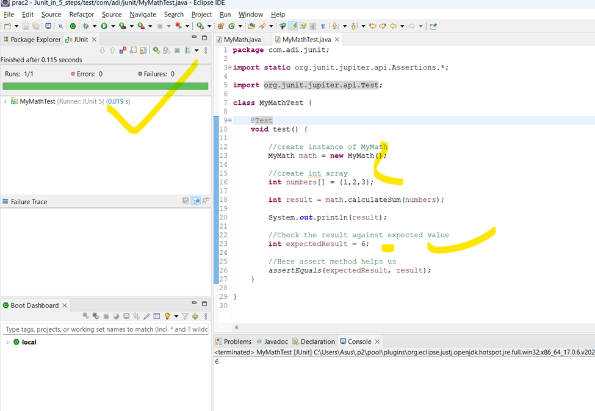

# ***Section-11. Introduction to JUNIT***
# 263 Step-1 What is Junit and Unit Testing?
apne s/w ki jar ya war file deploy karke test karna  usko --> ***system testing or integration testing kehte***..

apne individual method ya group of method ya particular class ki test karna called as ***Unit test.***


# 264 Step-2 Your first JUnit project and Green Bar
### We need a piece of code for which we write unit test. So let's create java project


### Let's create a class
```java
package com.adi.junit;

public class MyMath {

	//{1,2,3}=> 1+2+3=6 ((pass an array with number) and it return sum of it)
	public int calculateSum(int[] numbers) {
		
		int sum =0;
		for(int number : numbers) {
			sum += number;
		}
		
		return sum;
	}
}
```
### Write Junit Test for this method


### So all our source code is present in src folder and test related stuff (junit test) present in test folder
### Create Unit test

### Provide appropriate details


Assertion
-	दृढ़ कथन, निश्‍चयपूर्वक कथन, दावा


### Run it


### Red bar indicates test fail
### Now make this unit test pass & see Famous Green Bar which comes as test passes


### Write test for MyMathTest class

### Now check the result against expected value

### What happen if you change expected result to 5
```java
package com.adi.junit;

import static org.junit.jupiter.api.Assertions.*;

import org.junit.jupiter.api.Test;

class MyMathTest {

	@Test
	void test() {

		MyMath math = new MyMath();

		int numbers[] = { 1, 2, 3 };

		int result = math.calculateSum(numbers);

		System.out.println(result);

		int expectedResult = 5; //Changing to 5

		assertEquals(expectedResult, result);
	}

}
```

# 265 Step-3 Your first code and first unit test


